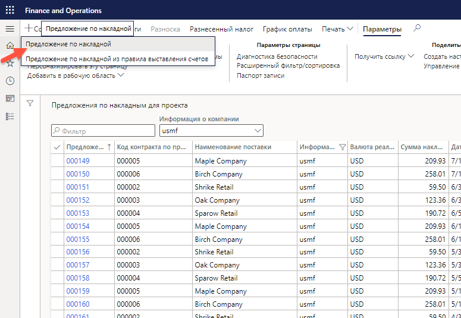
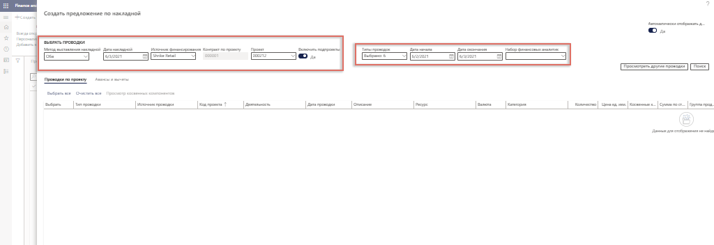
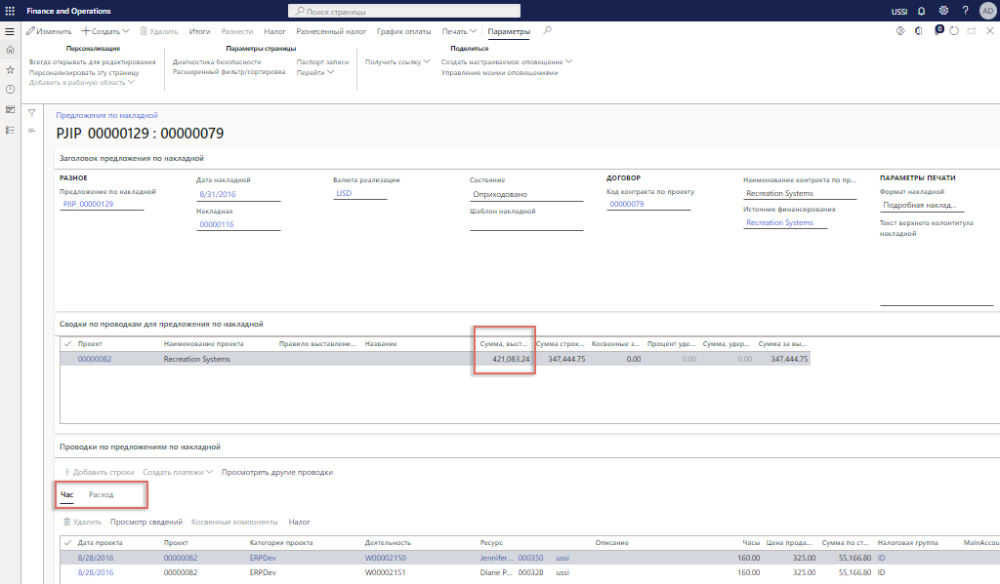

---
demo:
    title: 'Демонстрация 2. Создание накладной'
    module: 'Модуль 5. Изучение основ Microsoft Dynamics 365 Project Operations'
---

## Демонстрация 2 — создание накладной

1. Перейдите в рабочую область **Управление проектами**.  
    В этой демонстрации рассматривается процесс выставления счета по одиночному проекту в операциях проекта. Хотя возможно массовое выставление счетов, в демонстрационных целях сосредоточимся лишь на одиночном проекте с затратами времени и материалов. Также посмотрим в отчете по проекту результаты разноски и финансовый анализ. Давайте начнем выставление счета по проекту. 

1. Проверьте, чтобы в правом верхнем окне выбора компании, к которой подключаетесь, было указано юридическое лицо **USSI**. Если это не так, измените юридическое лицо на **USSI**.  
    В рабочей области **Управление проектами** отображаются все активные проекты. Можно искать проекты, пользуясь фильтром, но в этом примере выберем известный код проекта. 

1. В таблице **Активные проекты**, в столбце **Код проекта** выберите **00000093 Contoso Consulting**.  

1. Затем откройте страницу **Предложения по накладной проекта**, чтобы просмотреть все предыдущие накладные, обработанные для Contoso Consulting. 

1. На вкладке **СЧЕТ** панели операций нажмите кнопку **Предложения по накладной проекта**. 

1. На странице **Предложения по накладной проекта**, на панели навигации нажмите кнопку **Создать**, затем выберите **Предложение по накладной**.  
    Это простая накладная по затратам времени и материалов, поэтому нет необходимости выбирать вариант предложения по накладной из правила выставления счетов. 

    

1. В панели **Создание предложения по накладной** наводите указатель мыши на поля в разделе **Выбор проводок**.  
    Здесь можно выбрать такие параметры, как метод выставления накладной, дата накладной, источник финансирования и проект. Можно также выбрать включение подпроектов, а также ввести типы проводок, даты начала и окончания проводок и любые необходимые финансовые аналитики. 

    

1. В раскрывающемся меню **Проект** выберите **00000093 Contoso Consulting**. 

1. В этом примере убедитесь, что для параметра **Дата накладной** установлено значение **1/2/21**, для параметра **Дата начала** — **1/2/21**, и что дата окончания совпадает с текущей датой.  
    После того как все настройки выбраны, нажмите кнопку поиска, чтобы найти проводки, удовлетворяющие указанным параметрам.

1. Нажмите кнопку **Поиск**.  
    Затем, чтобы выставить все проводки по накладной, выполните команду «Выбрать все». В результате будут выбраны все позиции, отобранные нами по расходам и затратам времени.

1. На вкладке **Проводки по проекту** нажмите кнопку **Выбрать все**.

1. Нажмите кнопку **ОК**. 

1. На странице **Предложение по накладной** наведите указатель на столбец **Сумма строки накладной**.  
    Здесь отображаются сумма накладной и сводка по ней, почасовые проводки и расходы.

    

1. Наведите указатель мыши на вкладку **Почасовые**. 

1. Наведите указатель мыши на вкладку **Расходы**.  
    Можно также переключиться и посмотреть проводку расходов.  
Затем давайте нажмем кнопку проверки итогов, чтобы увидеть, как будет выглядеть накладная с точки зрения затрат и дохода.

1. На панели навигации нажмите кнопку **Итоги**.

1. На странице **Итоги** наведите указатель мыши на столбец **ГЛАВНАЯ КНИГА**, столбец **КЛИЕНТ** и на столбец **Скидка по строке**.  
    На экране итогов отображаются влияние на главную книгу, все сведения по клиенту, такие как кредитные лимиты, любые скидки, налоги с продаж и конечный эффект накладной. 

1. В правой части экрана нажмите кнопку **X**, чтобы закрыть страницу.  
    Сейчас все готово для предварительного просмотра печати с целью проверки точности сведений по выставлению накладной. В некоторых организациях предварительный просмотр используют во время совещаний по рассмотрению проекта, чтобы убедиться в согласии всех с итогами, прежде чем будет завершено создание накладной. 

1. На странице **Предложение по накладной**, на панели навигации нажмите кнопку **Предварительный просмотр**. 

1. В диалоговом окне нажмите кнопку **Предварительный просмотр**.  
    Здесь можно увидеть пример предварительного просмотра печати предварительной накладной. 

1. Нажмите кнопку **X**, чтобы закрыть страницу.  
    После того как все сведения проверены и все устраивает в предварительном просмотре накладной, можно выполнить проводку предложения по накладной.

1. На панели навигации нажмите кнопку **Разнести**.

1. Перейдите на вкладку **Параметры**.

1. В разделе **ПАРАМЕТР** установите для настройки **Разноска** значение **Да**.

1. В разделе **ПАРАМЕТРЫ ПЕЧАТИ** установите для настройки **Печать накладной** значение **Да**.

1. Нажмите кнопку **ОК**.

1. На странице **Накладная** наведите указатель мыши на пункт **Номер накладной**.  
    Теперь у нас есть сгенерированный номер накладной.  
    После того как накладная разнесена, можно просмотреть сведения в журнале накладных и подробно рассмотреть проводки главной книги.

1. Перейдите в рабочую область **Управление проектами**.

1. В таблице **Активные проекты** выберите проект **00000093** **Contoso consulting**.

1. На вкладке **СЧЕТ** панели операций нажмите кнопку **Журналы накладных**.

1. На странице **Журнал накладных**, на панели операций нажмите кнопку **Ваучер**.

1. На странице **Проводки ваучера** наведите указатель мыши на столбец **Счет ГК**.  
    Здесь отображаются результаты, разнесенные в главную книгу. Счета ГК определяются путем настройки счетов и финансовыми аналитиками, применяемыми к каждому проекту.

1. Перейдите в рабочую область **Управление проектами**. 

1. В таблице **Активные проекты** выберите проект **00000093 Contoso Consulting**.

1. На странице **Contoso Consulting**, на панели навигации откройте вкладку **Контроль**.  
    Здесь можно посмотреть все сведения по проекту.  
    Далее давайте взглянем на финансы проекта в отчете по проекту.

1. Выберите **Отчеты по проекту**.

1. На странице **Отчеты по проекту** наведите указатель мыши на раздел **ДАТА ПРОЕКТА**.  
Отчет можно создать для любого диапазона дат.

1. Выделите поле **С даты** и введите **1/2/2021**.
1. 
1. Выделите поле **До даты** и введите текущую дату.

1. По завершении нажмите кнопку **Вычислить**.

    

1. Наведите указатель мыши на пункт **Проводки**.  
    После обновления данных менеджер проекта может более детально рассмотреть сведения о проводках, чтобы принять решения по проекту или при необходимости внести уточнения. В этой демонстрации обработана накладная по затратам времени и материалов с почасовой проводкой и проводкой расходов. Мы предварительно просмотрели накладную, затем выполнили разноску накладной, проанализировали разноску ГК и в конце рассмотрели финансовое воздействие, пользуясь отчетом по данному проекту.
