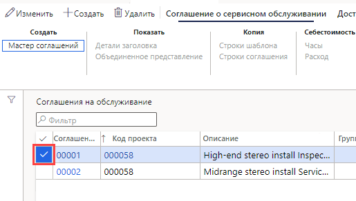
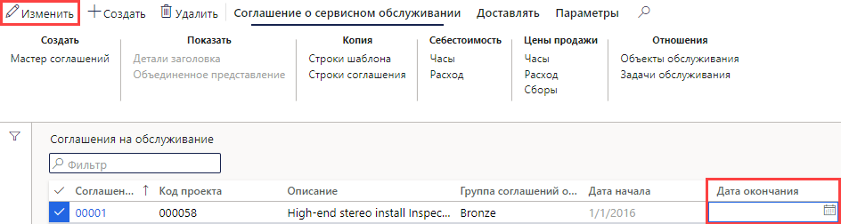

---
lab:
    title: 'Лабораторная работа 7. Создание планового заказа на работу'
    module: 'Модуль 1. Изучение основ Microsoft Dynamics 365 Supply Chain Management'
---

## Лабораторная работа 7 — создание планового заказа на работу

## Цели

Заказы на техническое обслуживание, размещаемые в системе, описывают техническое обслуживание или ремонт, в которых нуждается имущество, и используются в целях выделения соответствующих ресурсов для выполнения запроса на техническое обслуживание. У вашей компания есть действующий контракт на обслуживание и ей нужно подтверждение, что для проведения сервисного обслуживания оговоренных в контракте номенклатур создаются заказы на плановое обслуживание.

## Исходные условия выполнения лабораторной работы

   - **Ориентировочное время выполнения работы**: 10 мин

## Инструкции

1. На домашней странице Finance and Operations проверьте в правом верхнем углу, что вы работаете с компанией USMF.

1. При необходимости выберите компанию, открыв меню и выбрав пункт **USMF**.

1. На левой панели навигации последовательно выберите пункты **Модули** > **Управление услугами** > **Соглашения на обслуживание** > **Соглашения на обслуживание**.

1. Установите флажок в первом столбце первого соглашения на обслуживание.

    

1. Выделите поле **Дата окончания** и удалите текущее значение, а затем в меню вверху выберите команду **Сохранить**.  
 Дата окончания удаляется, так что для данного соглашения может быть создан новый заказ на сервисное обслуживание.

    

1. В меню вверху выберите пункт **Поставка**.

1. На панели ленты в разделе **Создать** выберите пункт **Плановые заказы на сервисное обслуживание**.

1. В области создания заказов на сервисное обслуживание в разделе **ПЕРИОД** установите для параметра **С даты** текущую дату и для параметра **До даты** дату, отстоящую от текущей даты на два дня.

1. В разделе **INFOLOG** установите переключатель **Показать Infolog** в положение **Да**.  
В результате отобразится список заказов на сервисное обслуживание, созданных для соглашения.

1. В разделе **ВКЛЮЧИТЬ ПРОВОДКИ ВИДА** установите переключатель **Почасовые** в положение **Да**.  
Типы проводок (транзакций) представляют строки, создаваемые в соглашении на обслуживание, причем выбираемая проводка каждого типа генерирует несколько заказов на сервисное обслуживание в зависимости от диапазона сервисного обслуживания, который задается в строке соглашения на обслуживание.

1. В разделе **ПАРАМЕТР** установите переключатель **Постоянные** в положение **Да**.  
Эта настройка используется для создания любых заказов на сервисное обслуживание, которые отсутствуют в постоянной серии заказов на сервисное обслуживание.

1. Нажмите кнопку **ОК**.
